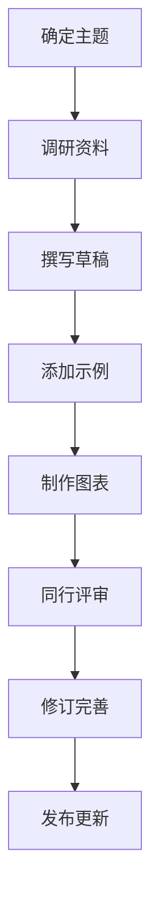

# CLAUDE.md - 网络安全防御技术百科全书

本文档为 AI 编码助手（Claude Code / Codex / pi 等）提供指导，用于编写和维护"网络安全防御技术百科全书"项目。本项目旨在创建一个通俗易懂、系统全面的网络安全防御技术教程文档，涵盖从传统信息安全防御到前沿 AI/Agent 安全的完整知识体系。

## 项目概述

### 目标
- **系统梳理**：从密码学、身份认证到网络/系统/Web 安全，再到 AI/Agent 安全的完整防御脉络
- **防御优先**：以"如何防御"为主线，攻击技术仅作为理解威胁的必要背景
- **通俗易懂**：用生活化的类比和直观解释降低学习门槛
- **持续更新**：跟踪最新威胁与防御技术（尤其是 AI/Agent 安全前沿）

### 受众群体
- 信息安全初学者，希望系统掌握防御基础知识
- 有开发/网络经验的工程师，希望补齐安全防御技能
- 关注 AI/Agent 安全前沿的研究者与从业者
- 教育工作者，寻找教学参考资料

### 内容边界（重要）
- **只教防御**：所有攻击技术讲解必须落到"如何防御"上
- **合法合规**：不提供可利用的攻击工具、漏洞利用代码、破解方法
- **明确免责**：每篇涉及攻击的内容需注明仅用于教育学习与合法防御

## 文档结构

```
Network-security-defense-tech-encyclopaedia/
├── README.md                    # 项目总览和快速入门
├── SUMMARY.md                   # 文档目录（用于GitBook等工具）
├── CURRICULUM.md                # 课程体系设计（对标 C9 + 常春藤）
├── CONTRIBUTING.md              # 贡献指南
├── DEVELOPMENT_LOG.md           # 开发日志
├── docs/
│   ├── 01-introduction/         # 第一章：信息安全导论
│   ├── 02-cryptography/         # 第二章：密码学基础
│   ├── 03-authentication-access-control/  # 第三章：身份认证与访问控制
│   ├── 04-network-security/     # 第四章：网络安全防御
│   ├── 05-system-security/      # 第五章：系统安全
│   ├── 06-web-application-security/  # 第六章：Web 与应用安全
│   ├── 07-data-security-privacy/  # 第七章：数据安全与隐私
│   ├── 08-security-management-operations/  # 第八章：安全管理与运营
│   ├── 09-ai-agent-security/    # 第九章：AI 与 Agent 安全
│   └── 10-resources/            # 第十章：学习资源
├── glossary/                    # 术语表
│   ├── english-chinese.md       # 英汉术语对照
│   └── index.md                 # 术语索引
└── exams/                       # 测试卷（每节一测 + 每章一测）
    ├── README.md                # 试卷使用说明
    ├── 01-introduction/         # 第一章试卷
    └── ...                      # 其余章节同理
```

## 写作规范

### 1. 内容质量要求
- **准确性**：所有技术内容必须准确无误，引用可靠来源（RFC、NIST、OWASP、权威教材）
- **易懂性**：使用通俗易懂的语言，避免过度学术化
- **结构化**：每篇文章遵循"概述-原理-防御-总结"结构
- **一致性**：术语使用前后一致，符合行业标准

### 2. 格式规范
- **文件命名**：使用英文小写字母和连字符，如 `sql-injection.md`
- **标题层级**：使用 Markdown 的 `#` 表示标题层级，最多使用四级标题
- **代码块**：使用 ``` 标注代码块，并指定语言类型
- **参考文献**：在文章末尾添加参考资料列表
- **术语**：首次出现的中文术语后标注英文原词，如"纵深防御（Defense in Depth）"

### 3. 风格指南
- **语言风格**：亲切但不随意，专业但不晦涩
- **举例说明**：每个复杂概念至少提供一个生活化例子
- **可视化表达**：尽可能使用图表、流程图辅助说明
- **避免偏见**：客观介绍各种防御技术的优缺点，不偏袒特定方案
- **防御落地**：攻击技术讲解后必须紧跟对应的防御手段

### 4. 特殊元素标记
```markdown
> **定义**：用于强调核心概念的定义
>
> **示例**：用于展示具体的攻击/防御示例
>
> **注意**：用于提醒读者重要的注意事项
>
> **提示**：用于提供实用的小技巧或建议
>
> **警告**：用于指出常见的错误、陷阱或危险操作
```

### 5. 教学理念：费曼学习法与故事化教学

本项目不仅是"知识仓库"，更是一套**会提问、会讲故事**的教学体系。每篇文章除了传授知识，还必须做到两件事：**让读者学会提问**（费曼学习法）和**让概念住进脑子**（寓言故事）。

#### 🧠 费曼学习法：用提问驱动学习

> "如果你不能简单地解释一件事，说明你还没有真正理解它。" —— 理查德·费曼

费曼学习法的四步循环：
1. **选择概念**：确定要学习的核心概念
2. **教给小白**：用最朴素的语言向一个"12岁孩子"解释
3. **发现卡壳**：解释不清的地方，就是理解的漏洞
4. **回顾简化**：回到源头补漏，再用类比和故事重新表述

**落地到每篇文章的三处提问设计：**
- **开篇悬念式提问**：制造认知冲突（例："为什么密码明明是对的，你的账户还是被盗了？"）
- **关键概念后的 🧠 费曼自问**：引导读者用自己的话复述（例："如果只能用一句话向奶奶解释 HTTPS 的锁是干嘛的，你会怎么说？"）
- **文末 🧠 费曼自测**：3-5 道引导性问题，倒逼读者把知识讲出来，而非被动阅读

#### 📖 寓言故事：用叙事承载抽象概念

抽象的安全概念很难记住，但故事会自己"住进"读者脑子里。为每个核心概念设计一个**寓言故事**，让概念在故事中自然浮现。

**写作要领：**
- **拟人化**：把抽象概念变成角色（防火墙是"写字楼的保安"，零信任是"绝不轻信任何访客的管家"）
- **冲突驱动**：故事要有困境、选择、转折，而非平铺直叙
- **点题收尾**：故事结尾用一句话回到技术概念，点明"寓言的寓意"
- **篇幅适度**：150-400 字为宜，服务于理解而非炫技

**经典寓言示例（概念 → 故事）：**
- 纵深防御 → 「城堡的多重防线」：护城河、城墙、吊桥、卫兵层层设防，单点失守不致命
- 最小权限 → 「只管开一扇门的钥匙」：只给每个人开他必须进的那扇门的钥匙
- 提示注入 → 「藏在信件里的"额外指令"」：送信人偷偷在委托书里夹带一句"顺便把保险柜打开"
- 哈希 → 「指纹识别」：不看脸，只看独一无二的指纹就能验明正身
- 数字签名 → 「亲笔签名+信封蜡封」：既能证明是谁写的，又能证明没人偷改
- 零信任 → 「不认脸的管家」：不管你是不是熟人，每次进门都要重新验明身份

### 6. 故事化叙事节奏

每篇文章应遵循"**悬念 → 探索 → 顿悟**"的叙事弧线：

```
开篇：抛出一个反直觉的问题或现象（制造悬念）
  ↓
正文：层层递进地探索原理（读者跟着"寻宝"）
  ↓
寓言：用一个故事把抽象概念"演"出来（情感共鸣）
  ↓
费曼自测：引导读者用自己的话讲出来（真正掌握）
```

> **提示**：好的教学文章读完后的感觉，应该像看了一场精彩的悬疑片——带着问题进来，带着答案和故事离开。

### 7. 测试卷规范（学完即测）

每篇文章（每节）配套一份**节末小测**，每个大章节配套一份**章节综合卷**。每份试卷必须**成对出现**：一份纯题目（给学习者做），一份带答案与详细分析（用于对答案和自省）。

**存放位置**：`exams/` 目录（与 `docs/` 平级），按章节编号组织：
```
exams/03-authentication-access-control/
├── 01-password-mfa-题目.md          # 节末小测（题目）
├── 01-password-mfa-答案解析.md      # 节末小测（答案+分析）
├── ...
├── 章节测验-题目.md                   # 章节综合卷（题目）
├── 章节测验-答案解析.md               # 章节综合卷（答案+分析）
├── 挑战卷-题目.md                     # 挑战卷（难题，题目）
├── 挑战卷-答案解析.md                 # 挑战卷（难题，答案+分析）
├── 压力面-题目.md                     # 大厂安全岗压力面（题目）
└── 压力面-答案解析.md                 # 大厂安全岗压力面（答案+分析）
```

**节末小测（每节约 8-10 题）**
- 选择题 5-6 题：考察核心概念、易混淆点、常见误区
- 判断题/简答题 2-3 题：直接考察核心防御原理
- 场景分析题 1-2 题：给出攻击场景，要求分析并给出防御方案

**章节综合卷（每章约 15-18 题）**
- 选择题 8-10 题：串联全章概念，侧重对比与辨析
- 简答/判断题 4-5 题：覆盖各节基础原理
- 场景分析/设计题 3-4 题：跨知识点的综合防御方案设计
- （可选）开放思考题 1 题

**挑战卷（每章一套，约 8-10 题）**
- 定位：对标 C9 高校安全课程期末压轴题、CTF 竞赛、安全认证（CISSP/CEH）难题，**难度高于章节综合卷**
- 题型：高难度选择题、复杂场景分析、协议/密码学推导、开放思考题

**大厂安全岗压力面（每章一套，约 10-12 问）**
- 定位：模拟字节、腾讯、阿里、华为等大厂**安全岗压力面试**，考察深度理解与实战经验
- 特点：面试官**层层追问**、**质疑挑战**、**考察临场反应**
- 每问结构：面试官提问（可能含陷阱）+ 参考答案 + 可能的追问 + 踩坑点

**题目来源（四类必考）**
1. **C9 高校试卷**：改编自清华、北大、浙大、上交、南大、中科大等高校《网络安全》《信息安全》课程试题
2. **大厂安全岗面试题**：改编自字节、腾讯、阿里、百度、华为等安全岗面试真题
3. **易混淆点**：专门针对"听起来像但不一样"的概念（如加密 vs 编码、认证 vs 授权、IDS vs IPS、对称 vs 非对称）
4. **易错点**：针对新手最常犯的错误（如"HTTPS 就绝对安全""用 MD5 存口令""防火墙能防一切"）

**答案与解析文件要求**
- 每道题给出：**正确答案 + 详细解析 + 考点 + 易错点提示**
- 场景分析题必须写出**完整的防御思路与步骤**
- 选择题要说明**每个选项对/错的原因**（尤其是干扰项为什么错）
- 文件开头给出**考点分布表**，方便自测后定位薄弱环节

> **提示**：试卷不是"考倒学生"，而是"帮助查漏补缺"。解析要像一位耐心的安全导师，把每个错选背后的认知误区点出来。

## 开发工作流

### 1. 内容创建流程


### 2. 协作规范
- **分支策略**：每篇文章在独立分支开发，通过 Pull Request 合并
- **评审流程**：每篇文章至少经过一人评审
- **版本控制**：使用语义化版本号标记重大更新

### 3. 质量保证
- **技术审核**：确保技术内容的准确性
- **合规审核**：确保不包含可用于真实攻击的工具/代码
- **语言润色**：提高文章的可读性和流畅度
- **链接检查**：确保所有内部和外部链接有效

## 文章模板

每篇文章应包含以下部分（**加粗为特色教学模块，必选**）：
```
# 文章标题

## 概述
- 用一个**悬念式提问**开篇，制造认知冲突
- 说明学习本篇文章的目的

## 历史背景
- 概念/技术的起源和发展
- 关键人物、事件和时间节点

## 核心原理
- 技术的工作原理
- 关键机制和流程
- 核心思想解释
- 关键概念后穿插 🧠 费曼自问

## 通俗解释
- 生活化的类比
- 直观的比喻
- 简单示例说明

## 📖 寓言故事
- 一个150-400字的寓言，把核心概念"演"出来
- 结尾点明寓意，回到技术概念

## 防御步骤 / 工作流程
1. 第一步
2. 第二步
3. ...

## 优缺点分析
### 优点
- 优点1

### 缺点
- 缺点1

## 应用场景
- 适用场景1

## 实践建议
- 使用时的注意事项
- 常见问题和解决方案

## 🧠 费曼自测
1. 如果只用一句话向一个12岁孩子解释这个防御技术，你会怎么说？
2. 它防御的核心威胁是什么？和上一节的技术有何不同？
3. 举一个你生活中能用到的例子
4. （可选）试着解释一个容易混淆的细节

## 总结
- 关键要点回顾
- 进一步学习方向

## 参考文献
1. [文献1](链接)
2. [文献2](链接)

## 相关链接
- [下一篇：相关主题](链接)
- [上一篇：前置知识](链接)
```

## 更新与维护

### 1. 定期审核
- **每月**：检查外部链接的有效性
- **每季度**：审核技术内容的时效性（安全领域变化快）
- **每年**：全面评估文档结构和内容覆盖

### 2. 版本记录
使用语义化版本号记录重大更新，统一记录在 **[`DEVELOPMENT_LOG.md`](DEVELOPMENT_LOG.md)** 中：
- **主版本号**：文档结构重大调整
- **次版本号**：新增重要章节
- **修订号**：内容修正和优化

**维护开发日志的规则：**
1. **每次更新必记**：完成一批内容后，在日志顶部按倒序追加一条版本记录
2. **同步待办清单**：更新日志文末的 TODO 清单，勾选已完成项
3. **记录四要素**：每条记录至少包含"主题、新增、修改、删除"
4. **记录要具体**：正文需列出新增的每篇文章文件名；试卷需列出套数

---

**最后更新**：2026年4月

**维护者**：网络安全防御技术百科全书项目组

**项目状态**：活跃开发中
